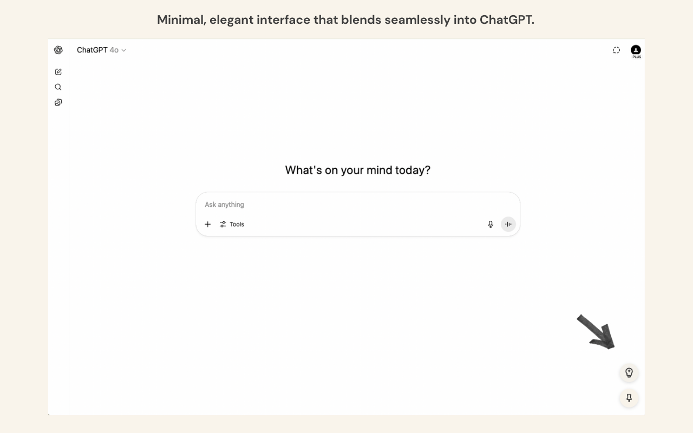
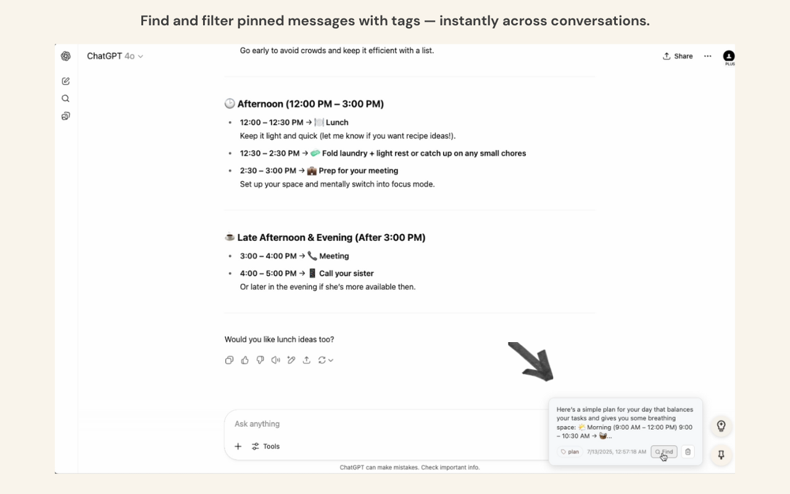
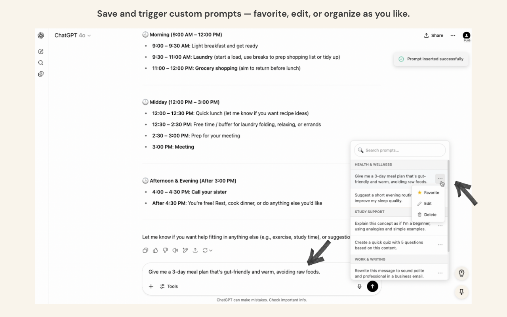

# Pinception – Pin & Reuse Your ChatGPT Messages

**Pinception** is a minimalist Chrome extension that helps you **pin, revisit, and reuse ChatGPT messages and prompts** — right inside the ChatGPT interface.

No more endless scrolling. No more retyping the same prompt. No more losing great answers in long threads.
&nbsp;

## 💡 Why Pinception?

ChatGPT is powerful, but it wasn't built for memory. Once a message scrolls out of view — it's basically gone.

Have you ever...

- Asked ChatGPT a long question and only understood the first part — but then lost track of the rest?
- Followed up multiple times, only to realize you want to jump back to an earlier reply?
- Remembered a great answer from last week, but had no idea which thread it was in?
- Found yourself typing the same prompt every day like:
  *"Can you rewrite this in a friendly tone?"* or *"Summarize this in bullets."*

If any of that sounds familiar, **Pinception was made for you**.
&nbsp;

## ✨ Key Features

| Feature | Description |
|--------|-------------|
| **Pin Messages** | Click on any ChatGPT reply to pin it for later |
| **Organized Sidebar** | Access your pins anytime from a clean floating panel |
| **Save Custom Prompts** | Store reusable prompts like templates or workflows |
| **Tags & Favorites** | Add categories, mark favorites, and search easily |
| **1-Click Prompt Execution** | Select a prompt and instantly inject it into ChatGPT |
| **Lightweight & Seamless** | No popups or heavy UI — it blends into your existing workflow |

All data is stored **locally** — no accounts, no sync, no tracking.
&nbsp;

## 🚀 How to Use

1. **Pin a message** by hovering over any ChatGPT reply — click the 📌 icon
2. **Access your pinned messages** anytime via the bottom-right "Pinception" panel
3. **Save a prompt** in the "Prompts" tab — you can categorize it, favorite it, or edit/delete anytime
4. **Use a prompt instantly** by clicking on it — it gets injected into the ChatGPT input box
5. **Set a default prompt** to auto-load when the input is empty (great for routines)

🧹 Want to start fresh?
Open the full HTML prompt manager (in the extension popup) and click **“Reset to Default”** to restore the original prompt library and structure.

🔎 All saved prompts and pins are fully editable, taggable, and stored locally.
&nbsp;

## 📷 Screenshots

| Minimal UI | Pin Panel | Prompt Panel |
|------------|-----------|--------------|
|  |  |  |
 

## 📦 Install

🔗 **[Get it on the Chrome Web Store](https://chromewebstore.google.com/detail/pinception/gegkjocbamflconbpcepdipelhlemdmj?authuser=0&hl=zh-TW)**

Or install manually:

1. Clone or download this repository
2. Visit `chrome://extensions/`
3. Enable **Developer mode**
4. Click **Load unpacked** → Select this folder
5. Start pinning inside ChatGPT!
&nbsp;

## 🔐 Privacy & Permissions

Pinception does **not** collect, store, or transmit any personal data.

- All pinned content and prompt data stays in your browser (`chrome.storage.local`)
- No third-party sharing, no remote code, no tracking

🔗 [Privacy Policy](./PRIVACY.md)
&nbsp;

## 📺 Demo Video
> Watch Pinception in action: [YouTube Demo](https://www.youtube.com/watch?v=a9q-wyNnTXg)
&nbsp;

## 🛠 Built with

- HTML, CSS, JavaScript
- `chrome.storage.local` for local persistence
- Content scripts for seamless ChatGPT integration
- Love for beautiful UX and GPT workflows 🤍
&nbsp;

## 🧠 Engineering Notes

This project was built entirely from scratch using native web technologies (no frameworks), with a focus on speed, simplicity, and a local-first user experience.

Key architectural design decisions include:

- **Manifest v3 Architecture**: Implements scoped extension layers (`popup`, `content`, `storage`) using modern Chrome APIs, fully compliant with MV3 standards.
- **Content Script Integration**: Injects listeners into the ChatGPT DOM to detect and enhance message replies without interfering with the platform's native behavior.
- **Persistent Local Storage**: Stores all pinned messages, user-defined prompts, and tags using `chrome.storage.local` — no backend or account required.
- **Popup UI as a Standalone Dashboard**: The HTML/CSS/JS popup interface serves as a standalone dashboard for viewing aggregate statistics and executing global routines (e.g., “Reset to Default”).
- **DOM Query Optimization**: Uses `MutationObserver` with debounced execution (`setTimeout`) and in-memory element caching to avoid redundant DOM traversal and preserve ChatGPT performance.
- **No Frameworks or Bundlers**: All components are hand-coded with vanilla JavaScript and CSS, with zero external libraries or build tools, ensuring fast load and minimal complexity.
&nbsp;

## ✨ Credits & License

Created by [Yu (Yulo) L.] — from concept to full-stack implementation.
This project was created as a personal tool to solve real GPT workflow problems, and is now shared publicly to help others do the same.

MIT License
&nbsp;

## 💬 Feedback or ideas?

Open an issue or start a discussion here on GitHub.
We’d love to hear how you’re using Pinception.
